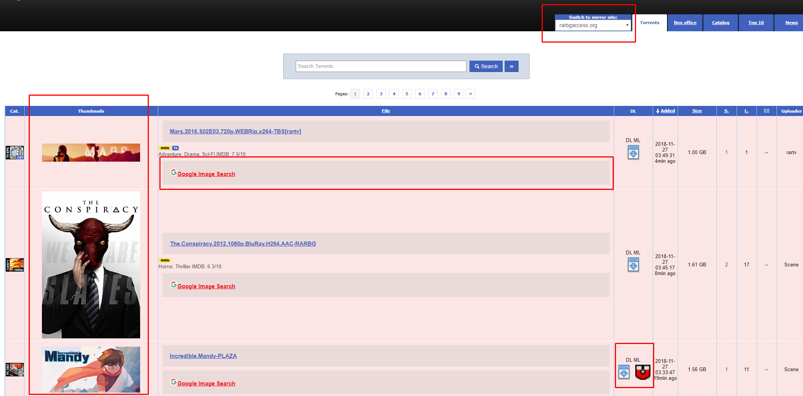
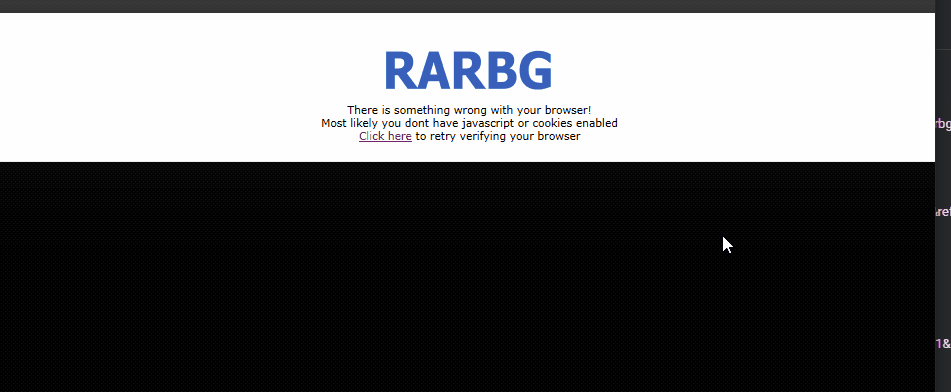
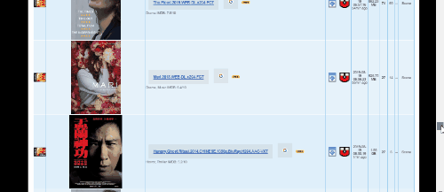
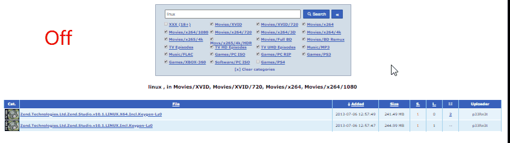
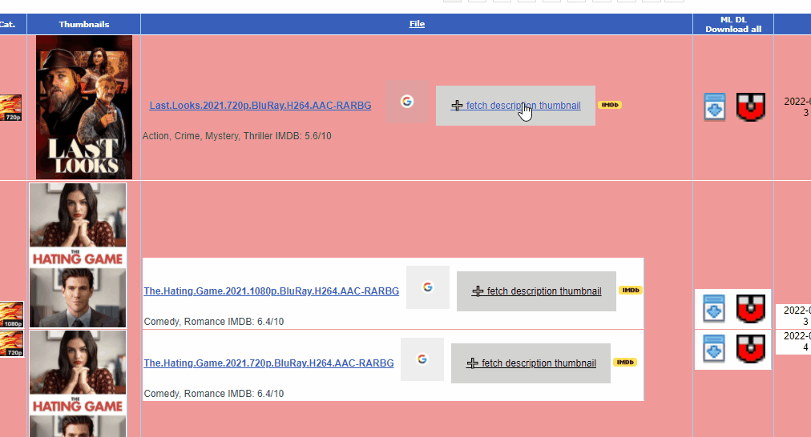
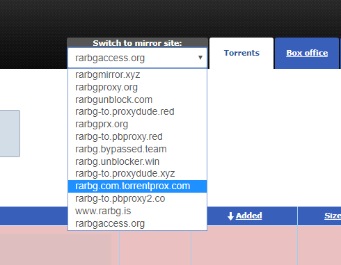
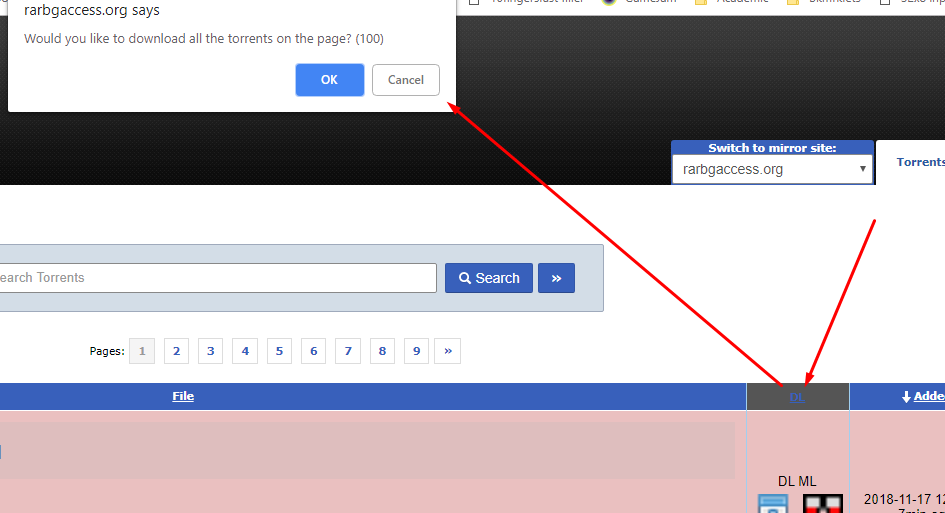
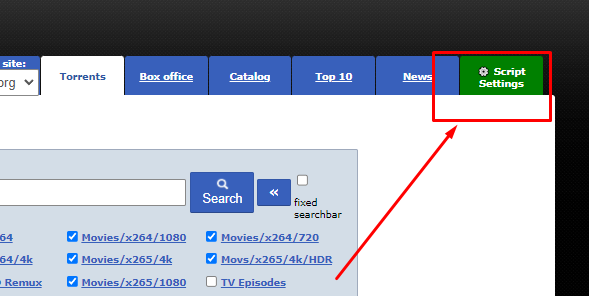
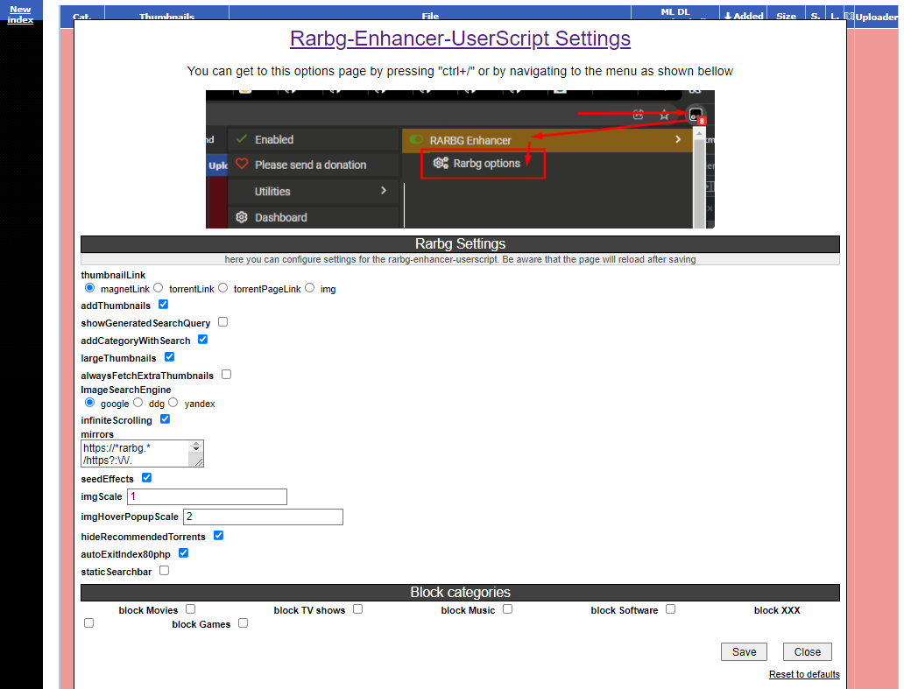

# Rarbg-Enhancer-UserScript

## Installation

- <a href="https://tampermonkey.net/"></a> Install [Tampermonkey](https://tampermonkey.net/) (this script is tested with tampermonkey). Or any other [UserScript client](https://www.greasyfork.org/) to your browser (this script has only been tested on
- <a href="https://github.com/buzamahmooza/Rarbg-Enhancer-UserScript/raw/master/Rarbg-Enhancer-UserScript.user.js"></a> Click the [RAW](https://github.com/buzamahmooza/Rarbg-Enhancer-UserScript/raw/master/Rarbg-Enhancer-UserScript.user.js) link of the script to install it to your userscript client
- <a href="https://rarbgunblocked.org/"></a> Open [Rarbg](https://rarbgunblocked.org/) or any of its mirrors and the changes should be there

(optional)  
if you just wanted the CAPTCHA bypass script and not the rest of the features, then use this [RAW](https://github.com/buzamahmooza/Rarbg-Enhancer-UserScript/raw/master/Rarbg-CAPTCHA-solver.user.js) link instead



## Features

This script adds features and enhances the [Rarbg](https://rarbgunblocked.org/) website

### Auto-solve CAPTCHA, and bypass the "Click to verify browser" page  
  
### Infinite scrolling (Auto-append next page)  
  The next page is appended at the bottom so there's no need to manually navigate to it

  
### Adds thumbnails to torrents  
  
### Add image search links to fetch Description thumbnail (from torrent page) and fetch extra images from Google Images
  
### Add magnet link and torrent links
### Dropdown list to go to other Rarbg mirrors  
  
### Download all torrents button  
  
### Disable some adds/redirect links

where the entire page is covered with an invisible redirect button

### Options menu
  1. 
  2. 

## Keyboard Shortcuts

- Press ```/``` to focus search bar
- Press ```ctrl+s``` to save an html file containing the page and torrent/magnet links
- Press ```d``` on a torrent page to download the torrent, it's sample images, the html page, and a summary
- Press ``` ` ``` to toggle thumbnail sizes (to load small or large thumbnails, helpful for slow connections)
- Press ```right arrow``` and ```left arrow``` to navigate between pages

## Credits

The script is written by me, however I have encorperated some code form other the following users:

- Darkred
  - I copied the code of [darkred](https://greasyfork.org/en/users/2160-darkred) from [this script used to add magnet and torrent links](https://greasyfork.org/scripts/23493-rarbg-torrent-and-magnet-links/code).
  - I also integrated this [script for converting timestamps to relative format](https://greasyfork.org/scripts/21550-rarbg-convert-torrent-timestamps-to-relative-format).
- Cisco
  - I originally got the idea from [this script](https://greasyfork.org/en/scripts/12648-rarbg-add-magnet-link) by the user [Cisco](https://greasyfork.org/en/users/16455-cisco).
  - This is just a shoutout to Cisco for inspiring me to start, as there was no contribution.

## Licence

This project licenced under the [MIT](LICENSE) license, this script is for educational purposes, I am NOT promoting piracy, this is just a tool to improve a website's UI.
